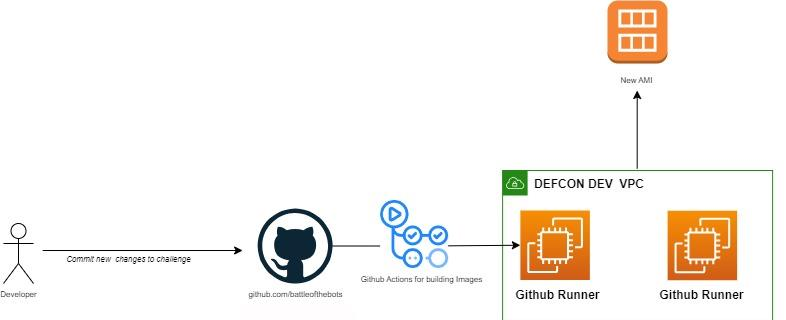
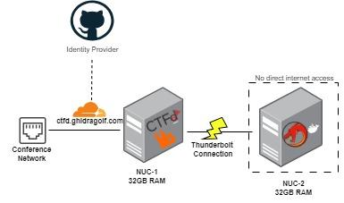
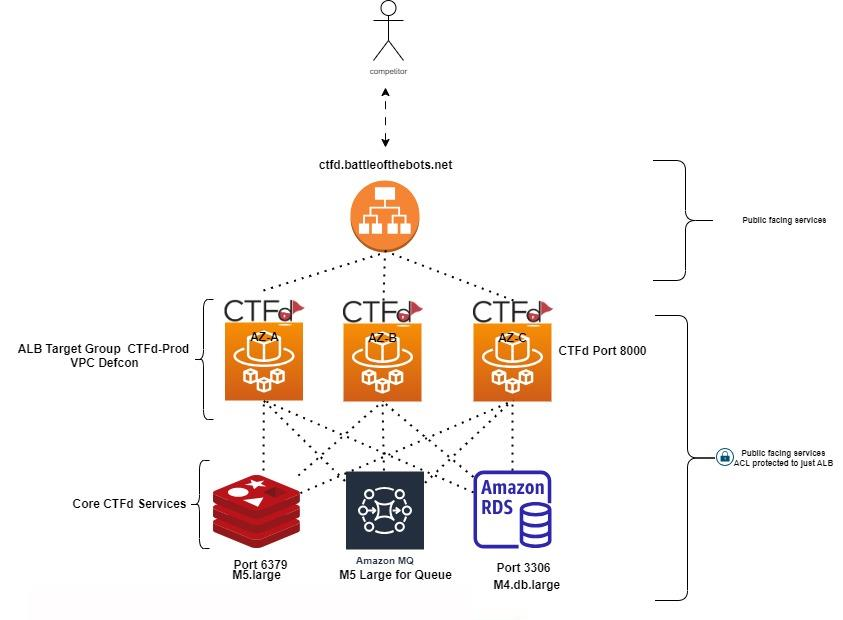
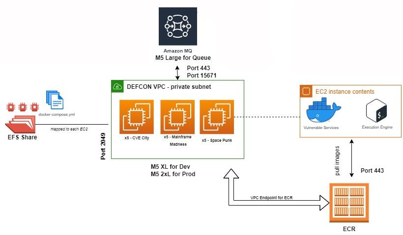
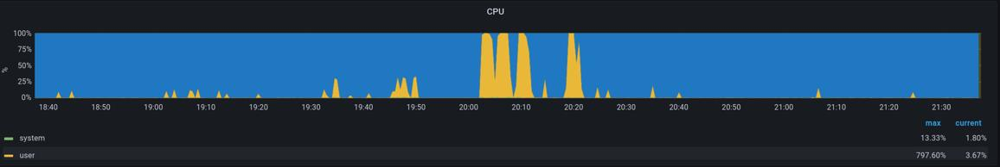
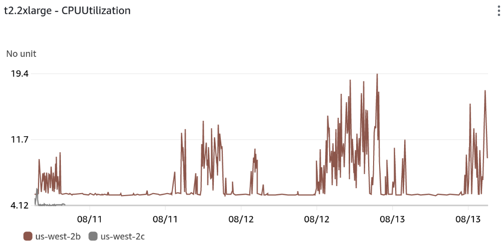
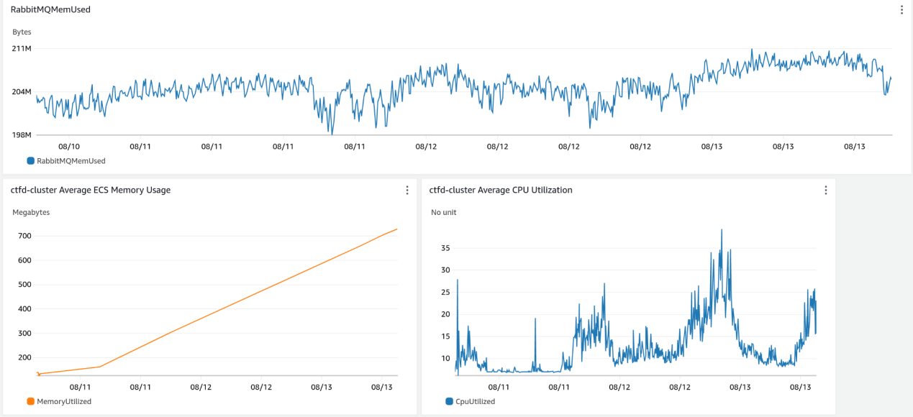
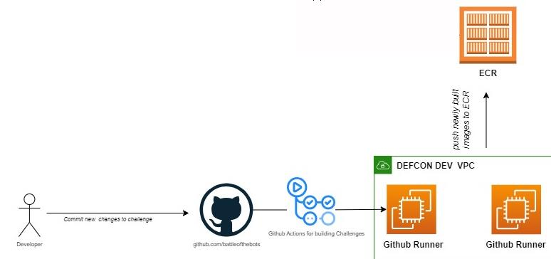
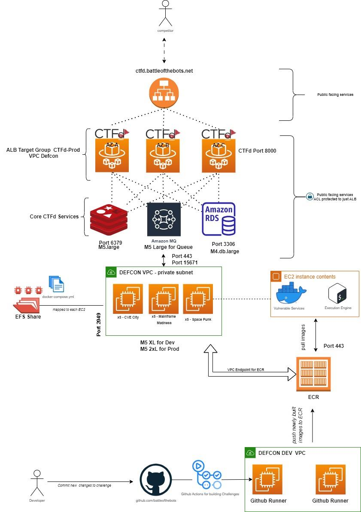

# Building Micro-CGC Events - Art of The Flag

Authors: Jared Stroud, Micah Martin, Daniel Szafran, Jon Bauer, Daniel Wolosiuk, Myles Sloan, Ayobami
Emmanuel Adewale, Brandon Adler, Enzo DeStephano, Niko Reveliotis, Owen Siebert, Wendy Wu

## Overview
Tasked by The Office of the Under Secretary of Defense for Research and Engineering (OUSD R&E) to
engage the public, private, and academic community via a series of Capture the Flags (CTFs) challenges,
the Micro-CGC team built three unique challenges in 2023 to spur conversation and assist in developing
skills to tackle difficult problems faced by all the sectors. To accomplish this task, the following
competitions were developed:

- [Ghidra Golf](https://ghidra.golf): A competition focused on automating reverse engineering tasks via Ghidra scripts. Competitors are tasked with building Ghidra Scripts to automatically solve common reverse engineering and vulnerability research tasks.

- [Battle of The Bots](https://battleofthebots.net) - Player vs Player (PvP): Competitors are tasked with compromising a series of vulnerable services, planting their flag to score points and preventing competing teams from taking over said services by backdooring and locking down hosts.

- [Battle of The Bots](https://battleofthebots.net)  - Player vs Environment (PVE): Competitors are tasked with building a "bot" or worm to automatically compromise machines and move deeper into a network planting their flag along the way.

Jeopardy style CTF events are commonplace at Information Security conferences. These events consist of
an online dashboard where competitors can download static artifacts (network packet captures, binaries
/disk images, etc…) to analyze, find, and submit the corresponding solution to said challenge to score
points. This competition flow is familiar to anyone who has competed in a CTF event. The Micro-CGC team
spent FY23 iterating on this design to involve more end-user interaction, ultimately having the competitor
build an “artifact” to submit and execute in the competition environment.

At ShmooCon this “artifact” was a Ghidra Script to solve reverse engineering challenges via Ghidra’s
headless execution engine. At BSides Charm and DEF CON, the artifact was a “bot” or malware developed
by the competitor to exploit vulnerable services selected by the Micro-CGC team based on CISA advisories,
publicly available threat intelligence reports, and OWASP Top Ten vulnerabilities.

A unique challenge for the Micro-CGC team was granting competitors the ability to execute arbitrary code
in said environment while avoiding adverse effects of potentially rogue competitors. This document will
detail how the Micro-CGC team threat modeled, designed, built, and deployed secure CTF infrastructure
in AWS and on-premise environments. Additionally, the document will cover the Micro-CGC team’s
approach to challenge development and competitor interaction.

The goal of this document is for future CTF architects to learn, iterate, and deploy Battle of The Bots,
Ghidra Golf or similar CTF events in the future. Where possible, content has been made Open Source and
available at both the [Ghidra Golf](https://github.com/ghidragolf) and [Battle of The Bots](https://github.com/battleofthebots/repositories) GitHub organizations’ repositories for others to
run events in the future.

## The Art of Crafting "Good" Challenges
One of the hardest parts for any Capture the Flag event is building good, meaningful challenges for the
competitor. One must first define what a “good” challenge is, and this is a deeply opinionated answer that
will vary from developer-to-developer. Ultimately, the goal of the Micro-CGC events were to have
competitors walk away with learning something new that could immediately impact their day job. To
achieve this, the Micro-CGC team took a “threat informed” approach to challenge development. The
"threat informed" component of our challenges was guided by numerous data sources including: CISA
advisories, Open-Source threat intelligence reports, and commonly exploited CVEs. Creating "threat
informed" challenges representative of real-world threats was a focus of the Micro-CGC challenge
development team to ensure the competition would be more of a training event rather than just a
traditional skill-based competition.

Creating quality threat informed challenges requires more than just threat intelligence. The Micro-CGC
team also had to consider how the challenge would be deployed within Micro-CGC infrastructure. The
team utilized a multi-step challenge creation process broken into the following steps: Discovery,
Assessment, Deployment & Quality Assurance. Researching the threat intelligence to craft a challenge idea
falls in the Discovery stage. Browsing CVEs or reading the latest threat intelligence reports would spur
ideas within the team.

Once armed with an idea, the team would perform a challenge assessment; this
included exploring the viability of a challenge in terms of deployment and reliability. The assessment phase
requires analyzing the challenge from the perspective of a competitor and understanding the compute
resources required for deployment. Identifying environment constraints early on such as architecture and
what underlying platform to use will avoid deploying challenges that require unique environments and
ultimately require more attention from the infrastructure team.

To give an example, for Battle of The Bots each challenge had to be operable within its own Docker
container running from our common BOTB base image which used Ubuntu 20.04. Additionally, the Micro-
CGC team determined that all challenges would be x64. This means challenges were constrained to
running on Ubuntu 20.04 with a x64 instruction set; if challenges were unable to be deployed under these
constraints, they were removed from the competition. If challenges were unable to be solved reliably, they
were removed from the competition; reliability when solving challenges creates a more consistent
experience for competitors and is one of the reasons the Micro-CGC team avoided vulnerabilities with
inconsistent exploits (such as race conditions). It is once these prerequisite steps are completed, a
challenge would be developed then deployed within our infrastructure. Details on quality assurance and
deployment of challenges are further described in a later section of this post

### Crafting Challenge Names and Descriptions

The first impression a competitor has of a challenge is the challenge name and associated description.
Giving challenges a name and a description is a bit of an art form. Often the name and description are
indicative of what the solution may be. Giving away too much in the name or description takes away the
joy in finding a solution to the problem. Giving away too little leads to time wasted chasing down false
leads. Ideally a challenge name should be intriguing and give a subtle hint as to the nature or subject of a
challenge. For example, one of the challenges for Battle of the Bots PVE was called “Smile and Wave;”
this title utilizes a well-known InfoSec pop-culture reference to allude to the infamous smiley-face backdoor in
VSFTPD ([CVE-2011-2523](https://nvd.nist.gov/vuln/detail/CVE-2011-2523)).

Once a competitor selects a challenge, they are shown the challenge description. The description should
provide the important context needed to solve the challenge, along with any supplementary files. Using
the “Smile-and-Wave” example again, the description for the challenge was: "This smile sent waves
through the FTP community." This provided insight into the keywords (FTP and smile) competitors could
use to find the information needed to solve the challenge.

The “Smile-and-Wave” title and description are **very** heavy-handed hints.
This was intentional, as the primary focus of Battle of the Bots PVE was on bot development, not simply how to compromise a particular host. In order to allow competitors to focus more on implementing their bots or Ghidra scripts, the Micro-CGC team erred on the side of giving more context than a traditional Jeopardy style CTF.
Challenge difficulty also factors into how generous hints should be. If a challenge is on the easier side or
aimed at an introductory audience (“Smile-and-Wave” was a lower difficulty challenge), giving the
competitor a little bit more to go on will increase their chances of success and thus the likelihood that
they learn something.

More experienced or knowledgeable competitors will also appreciate generous hints on easier challenges as they reduce the tedium of working through the easier challenges, allowing them to focus on more difficult challenges closer to their skill level where they are most likely to learn. This is especially true if solving easier challenges is a requirement for unlocking more difficult challenges. The name and description are only one way the competitors to learn about challenges. Having channels for competitors to communicate with and question challenge authors is important to resolve issues when descriptions are too vague.

### Developing & Distributing Competitor Deliverables
It is important to maintain good operational security when providing challenge files. Secrets and other
sensitive information about the development environment can leak into files like packet captures,
compiled binaries, and container images immediately causing risk to a CTF environment. The Micro-CGC
team frequently utilized Docker environments to provide disposable sanitized environments to produce
files that would be delivered to competitors. Leveraging “.dockerignore” prevented “.git” and other
directories from being copied into containers that were deployed into production environments or made
public to competitors.

The unique challenge of Ghidra Golf provided an additional difficulty with challenge file development.
Normally, when distributing a binary for reverse engineering or pwn challenges, the challenge flags come
directly from the binary, so developing one version of the source code and thus one binary is sufficient.
This would not work for Ghidra Golf, as providing a single binary would allow competitors to reverse
engineer the binary locally and simply have their Ghidra script print the flags they discovered instead of
automating the flag finding with their script. Instead, each challenge for Ghidra golf required the
development of at least two copies of each challenge binary: one to be given to competitors, and the other
to test their scripts against on the backend

### Wrangling Challenge Difficulty & Quality Assurance
One of the more subjective, but very important aspects of challenge development is balancing how difficult or
frustrating a challenge will be to solve and how fun it will be for the competitor. The Micro-CGC team primarily used three major categories when trying to level-set challenge difficulty. These categories were time, skill required, and a “frustration factor”. Competitors can only solve challenges while an event is running, therefore, challenges that require more time to complete should have their point values scaled appropriately. This becomes more important when challenges are only unlocked after other challenges are solved, as the time requirements of the prerequisite challenges also must be factored into the difficulty calculation.

When working with exploits it can be difficult to develop a stable payload that works 100% of the time,
and it can also be difficult to set up a local testing environment. With environments like Battle of the
Bots PVE where competitor submissions were run in an environment that they couldn’t interact with
directly, it could easily become frustrating to debug finnicky exploits or inconsistencies in the
environment. Competitors won’t keep playing if they aren’t having fun and if they’re not having fun,
we’re not providing an optimal CTF experience.

A challenge development team also faces difficulty constraints. The time to develop challenges before
the event and skill level of the challenge development team are factors as to the difficulty ceiling a
challenge development team can produce. Developing and testing difficult challenges can be very time
consuming and if not done well, can lead to broken challenges and quality assurance concerns.

There is hardly a more frustrating feeling as a competitor than doing everything correctly and not getting
rewarded with the right answer due to an error in the challenge itself. Following some issues with broken
challenges during Ghidra Golf, the Micro-CGC team implemented a mandatory proof-of-concept
requirement for each challenge for Battle of the Bots. While this practice may limit the number of
challenges a development team is able to produce, it provides a guarantee of quality, as well as providing
a resource for staff running the competition to use when helping competitors work through any
difficulties they may be having. After identifying the number of easy, medium, and hard challenges its
time to discuss point values for these challenges.

### Identifying Point values for Challenges

A challenging aspect to running CTF events is assigning point values to challenges. This often comes down
to the challenge developer’s thoughts on what a “100” point challenge is vs a “300” point challenge from
their personal experience in competing in CTFs. To combat anecdotal experience, the Micro-CGC team had
conversations around the steps and background knowledge involved in solving challenges that would lead
to a final decision on point value.

An example of what the Micro-CGC team would identify as a lower point challenge would be a packet
capture with an exploit payload in plain text. This would require the competitor to search the web for the
plain text payload to identify the corresponding CVE and submit that for points. This would be considered
an “easy” challenge and result in 50 points, the lowest value on our scale.

These “low point” challenges serve a larger purpose of giving the competitor the ability to score points
(which is a great feeling) and walk the competitor down the path of what to do next. For example, these
“static” challenges would be used in conjunction with the Battle of The Bot capability development
challenges to inform the competitor what exploit they would now have to use in their bot to compromise
a given machine. For Ghidra Golf, this took the form of the “Putting Green” challenges – a series of very
low difficulty challenges whose descriptions walked competitors through how to write their first Ghidra
script and perform basic versions of the tasks harder challenges would require them to perform. This dual-
pronged approach allows for challenges to show a competitor what next steps are necessary to move
further in a competition without the use of “hints” while also providing the competitor the ability to score
points.

### Communication & Transparency with Competitors

For any CTF event to be successful, it must have competitors. Competitors are investing their valuable
conference time with the event to learn something new, potentially win a prize, but ultimately enjoy the
competition being run. When an issue arises and a flag is incorrect, or a challenge is broken, having a
transparent conversation with the competitor is critical to ensure they have a positive experience.
Competitors are your customers, and ideally should want to come back and continue playing year after
year. The Micro-CGC team leveraged Discord and their “forum” capability to enable asynchronous chats
with competitors and visibility for all competitors for common questions. This put the good, bad, and the
ugly on display for all to see enabling the team to quickly address issues as competitors ran into them.

A frequent point of confusion early on was the wording of challenges. To address this in the future, the
Micro-CGC implemented more in-depth quality assurance reviews by individuals not involved in challenge
development. Ultimately this feedback led to better competitions and more successful events.

Aside from great challenges, a CTF must have stable and secure infrastructure for their competitors.
The remainder of this document will shift focus on how the Micro-CGC team threat modeling and deployed secure CTF infrastructure for Ghidra Golf and Battle of The Bots.

## Threat Modeling CTF Events
Each event executed by the Micro-CGC team contained an element of executing untrusted code submitted
by competitors. While its standard practice for CTFs to have explicit policies against attacking competition
infrastructure, that doesn’t stop a motivated rogue competitor from trying. To minimize the risk of a
security incident, the Micro-CGC team enforced a series of defense-in-depth practices, reducing the risk
to a level deemed acceptable by team members for both on-premises and cloud-based deployments. The
following non-exhaustive controls were implemented to reduce the risk of running user submitted code in
the execution environment:

- Hardened base image from Center of Internet Security (CIS).
- Vulnerability scanning of deployed container images.
- Vulnerability scanning of host infrastructure.
- AWS Guard Duty for continuous cloud monitoring.
- Ingress/Egress Network Access Control across VPC.
- AWS VPC Endpoints to limit egress traffic.
- Mandatory multi-factor access to production services.
- Host Resource monitoring (Grafana/Prometheus – Ghidra Golf specific)
- Runtime scanning of submitted scripts (Ghidra Golf specific)
- Isolated container networking.
- Isolated host networking for execution hosts.
- Limited container capabilities.

Each of these bullet points were implemented differently depending on the competition due to unique
constraints that both the competition and hosting environment provided. Ghidra Golf was entirely on-
premises at ShmooCon in Washington DC. Battle of The Bots, Player-vs-Player was a hybrid environment
with our scoreboard (CTFd) being hosted in AWS, and finally an all-cloud environment was used for Battle
of The Bots: Player vs Environment at DEF CON. The next sections discuss unique aspects the Micro-CGC
team encountered with regards to these configurations and hopefully serve as a jumping off point for
future CTF architects.

## Platform Building, Hardening and Vulnerability Scanning
Each event leveraged a combination of containers and virtual machines to host infrastructure essential to
the success of the competition. Having a security hardened base image for these environments was critical
to having a strong foundation to build upon. The Micro-CGC team leveraged Open Source vulnerability
scanners in combination with automation platforms to reliably build and deploy competition
infrastructure. The following sections outline the Micro-CGC’s approach to hardened image building and
vulnerability scanning.

### Continuous Hardening Image Building with Github Actions
The Battle-of-The-Bots: Player vs Environment competition hosted at DEF CON relied on Center for Internet
Security (CIS) AMI images obtained through the [Amazon Marketplace](https://www.cisecurity.org/cis-hardened-images/amazon) for the underlying host OS. By
leveraging these images as a starting point, the Micro-CGC team had a hardened base image they
customized to their needs. Additional modifications to the image were done via Hashicorp’s [Packer](https://www.packer.io/) utility.

Packer automates the process of building and updating system images often referred to as “Golden
Images”. The Micro-CGC team leveraged GitHub Actions and self-hosted runners in AWS to repeatedly
build these images and publish Amazon Machine Images (AMIs) to be used by [Terraform](https://www.terraform.io/) for execution host deployment. By hosting the associated packer configuration file, and host configuration scripts in GitHub, any member of the team could modify and update the base image as needed. This workflow is visualized in figure-1 below.

figure 1 - Building Images with Packer

### Common Base Image for CTF Container Challenges
For all Micro-CGC events, competitor-facing challenges were deployed in containers. An issue the Micro-
CGC team ran into early on was having numerous different base container images for their respective
challenges. This led to issues with one-off builds, different package versions across challenges and longer
build times due to lack of caching images. To address this, the Micro-CGC team identified a base image
that would work for all challenges and leverage multi-stage builds for unique situations that required
additional configuration. This significantly improved troubleshooting of issues and container build times
due to layer caching. Additionally, leveraging the same base layer led to easier vulnerability scanning of the container via [Trivy](https://github.com/aquasecurity/trivy). Ultimately ensuring there were vulnerabilities where we wanted them, and patches where we needed them.

#### Case Study: On-prem Vulnerability Scanning for Ghidra Golf
The Micro-CGC team leveraged [OpenSCAP](https://www.open-scap.org/tools/openscap-base/) for on-premises host scanning to identify and remediate vulnerabilities on the competition host operating systems. At the container level, Trivy, an Open-Source security scanner was used to scan container images being deployed in production. Security vulnerabilities identified by Trivy were then assessed by criticality and patched accordingly. To ensure our security controls were working as expected, [Linpeas](https://github.com/carlospolop/PEASS-ng/tree/master/linPEAS) a script to automatically attempt privilege escalation and perform host recon was executed in each deployed container to asses security controls.

Linpeas was chosen due to the ability to easily automate testing via a [curl one liner](https://github.com/carlospolop/PEASS-ng/tree/master/linPEAS#quick-start) and robustness in
testing and container attack surface reconnaissance capabilities. While no one tool can assess all possible
misconfigurations, Linpeas provides an easy avenue to identify “low hanging fruit” misconfigurations in
container, virtual and bare metal environments.

Cloud Architects from the Micro-CGC team gave a presentation on the specific usage and implementation
of these security controls at Carnegie Mellon’s DevSecOps Days in the Spring of 2023. A deeper dive into
this content can be found at a recording of their talk [available here](https://www.youtube.com/watch?v=h2uePybb7fk&list=PLSNlEg26NNpxpml6sxgxVB0EXOCT162gm&index=8) or within the [slides](https://github.com/ghidragolf/DevSecOpsDays_GolfingWithDragons).

#### Case Study: Ghidra Golf - Building an Isolated Execution Environment
The Ghidra Golf competition was run with two 8th generation i7 Intel NUCs. Each machine was configured
with 32GB of RAM and a thunderbolt-3 link networking two NUCs together giving theoretical throughput
of over 10Gbps between both NUC. NUC-1 hosted CTFd with our custom CTFd plugin to enable script
submission, Cloud Flare tunnels and RabbitMQ. The image below shows the topology of said NUCs.

 Figure 2 - Ghidra Golf Infra 

 

Cloud Flare tunnels enabled the Micro-CGC team to expose CTFd publicly behind unknown networking
environment like those met at Information Security conferences. The Micro-CGC was able to leverage
Cloud Flare tunnels to reliably expose services behind NAT and other unknown network controls with the
caveat that HTTPs was allowed outbound on the conference network. Cloud Flare tunnels were also used
as a mechanism of authentication for remote access to the NUCs. For a team member to gain SSH access
to the NUCs, they had to be added to a specific GitHub organization, enable two-factor authentication to
said account, and have their public key placed on the NUC to enable remote SSH access. This feature set
is a part of Cloud Flare’s “Zero Trust” suite of products with Cloud Flare Tunnels and appropriate
documentation can be [found here](https://developers.cloudflare.com/cloudflare-one/connections/connect-networks/use-cases/ssh/).

The RabbitMQ service enabled a producer-consumer model where on NUC-2, the [Ghidra Script execution
micro-service](https://github.com/ghidragolf/gg-consumer) would read from a RabbitMQ queue, execute the competitor’s script, and return the corresponding success/failure output to the CTFd plugin. Leveraging Docker overlay networking, the thunderbolt connection allowed the Micro-CGC team to execute scripts on a dedicated host (NUC-2) that did not have direct internet access. This in combination with dropping container capabilities resulted in the Micro-CGC team feeling comfortable with their security controls for running said event.

## High Availability with CTFd & AWS Managed Services
DEF CON is one of the largest Information Security conferences, with recorded attendance exceeding
twenty thousand individuals. To ensure Battle of The Bots executed without infrastructure issue, the
Micro-CGC team decided to leverage managed AWS services to host the core CTFd components. This
includes Redis, MySQL, the CTF application (a Python Flask app) and RabbitMQ for custom integrations.
To ensure repeatability, all of the AWS resources shown in this section and in the Appendix were
automatically deployed via Terraform, which is available within the Battle of The Bots GitHub organization’s repository (*coming soon*).

The workflow is as follows, a competitor would login to ctfd.battleofthebots.net which led to an Application
Load Balancer (ALB) that sat in front of three CTFd instances hosted on AWS’ Elastic Container Service
(ECS). Leveraging round-robin load balancing and sticky-sessions, user requests were distributed across
three different availability zones ensuring not one container would be overloaded with network traffic.
Backend databases Redis and MySQL (RDS) were deployed in a high availability configuration as well with
regular snapshots taking place to ensure the ability to recover should an infrastructure issue occurred.
Finally, Amazon MQ’s managed RabbitMQ service was used to bridge into our private VPC where EC2 hosts
ran custom software to deploy a unique set of vulnerable containers for competitors to exploit per-
submission. Figure-3 below visually shows this environment.

 Figure 3 - Battle of The Bots: PVE Infra 

 

While managed services typically come at a higher monetary cost, it enabled the Micro-CGC team to
devote their time to handling contestants’ questions and engaging with the community at DEF CON. After
a user submits their bot to CTFd, the binary is dropped into a unique folder within a mounted Elastic File
Share (EFS) drive and a UUID is passed to RabbitMQ. The “execution engine” running on EC2 hosts reads
data from Amazon MQ to copy the competitor’s binary into the container execution range before
detonating the binary against the Docker infrastructure. Containers in the Docker infrastructure were on
Docker “internal” networks, preventing competitors from being able to leverage their access against out-
of-scope competition infrastructure. The EC2 hosts within this VPC do not have direct internet access but
can access AWS services (ECR/EFS/etc.) via VPC endpoints available throughout the VPC. This ensured new
challenge containers could be pulled down onto the EC2 hosts without requiring internet access. Figure-4
below shows the non-public execution environment for Battle of The Bots: Player-vs-Environment

 Figure 4 - Player vs Environment 

 

## Monitoring CTF Infrastructure

### On-premise Monitoring with Grafana and Prometheus
Grafana and Prometheus are prominent tools in the DevOps space to obtain and graph system metrics in
enterprise environments. The Micro-CGC team leveraged these utilities to monitor CPU and memory usage
overtime for Ghidra Golf. The Ghidra “analyzeHeadless” script was used for Ghidra Golf to execute the
competitor submitted Ghidra Script against a challenge binary. During analyzeHeadless execution, Ghidra
must load, parse, and analyze a binary before executing the user’s Ghidra Script. This results in a
computationally intensive task causing CPU utilization to spike, thus monitoring CPU utilization was critical
to the success of the competition. Midway through Ghidra Golf, a significant CPU spike occurred causing
an alert for the Micro-CGC team. Figure-5 below shows the spike in our Grafana dashboard.

 Figure 5 - CPU Spike 

 

Host based triage identified the challenge that was spiking utilization and revealed that a statically
compiled binary was causing significant CPU utilization due to parsing libc and additional libraries compiled
within said challenge. The Micro-CGC team was able to re-deploy the challenge as a dynamically compiled
binary ensuring no further competitor time was wasted waiting for submission results, and normal CPU
utilization was restored.

### AWS Monitoring & Cloud Security
The Micro-CGC leveraged Cloud Watch dashboards to monitor overall CPU and memory resource
utilization by both managed and self-managed AWS services. Analyzing memory and CPU trends overtime
enabled the team to identify when and if micro-services or additional EC2 host were required to support
the competition. Additionally, resource utilization monitoring allows CTF Architects to gain an
understanding of where resources may be overprovisioned and opportunities to cut costs by decreasing
the resources required for a given managed service. Figure-6 below shows the trend of resource utilization
over time in the AWS environment during Battle of The Bots at DEF CON

 Figure 6 - AWS Memory & CPU Monitoring 

 

In addition to CloudWatch dashboards, Guard Duty alerts were monitored for abnormal API actions
during the competition. Once our infrastructure is deployed, the Micro-CGC team could monitor for
abnormal API requests during the competition. During Battle of The Bots, no abnormal events were
identified causing concern for the team.

### Reducing Mean Time to Resolution with Challenge Issues
While the Micro-CGC team had dedicated Quality Assurance engineers to assess challenges for
completeness and reliability, occasionally issues happen in deployment with challenge deployment
resulting in broken challenges. Broken challenges ruin competitors’ experiences and the valuable time
they’re spending with the competition. The Micro-CGC team minimized time to resolution using self-
hosted GitHub runners to build and publish challenges to AWS’ Elastic Container Registry (ECR). Should an
issue arise with a challenge, the challenge developer could simply update the code in GitHub, have a
GitHub Runner build the code and push the resulting Docker image to ECR. Then, our custom challenge
execution engine would pick up the new container image on the next deployment. This workflow is
highlighted in figure-7 below.

 Figure 7 - Continous Challenge Deployment

 

## Capturing Flags, Hearts and Minds

The Micro-CGC team loves CTFs and the community around them.  We hope this document serves as a blueprint for CTF Architects seeking to ensure a secure and highly availability competition infrastructure for their upcoming event. For more information, and to stay engaged with the team, please join our Discord community. The respective links can be found on the Ghidra Golf and Battle of The Bots websites. The Micro-CGC team would like to thank competitors once again for participating and for building an online community this past year.

## Appendix

 Figure 9 - Entire AWS Infrastructure

 

Approved for Public Release. Distribution Unlimited 22-03743-32023 The MITRE Corporation. ALL RIGHTS RESERVED
