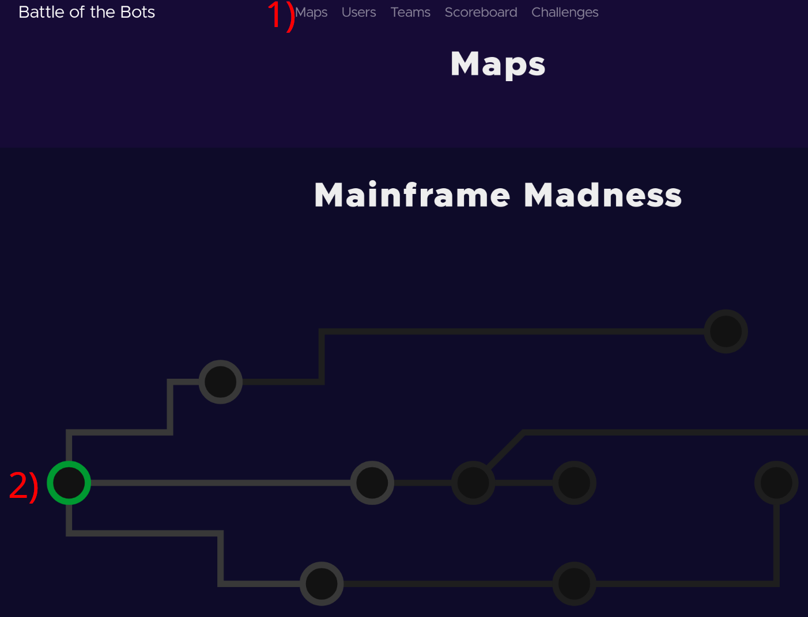
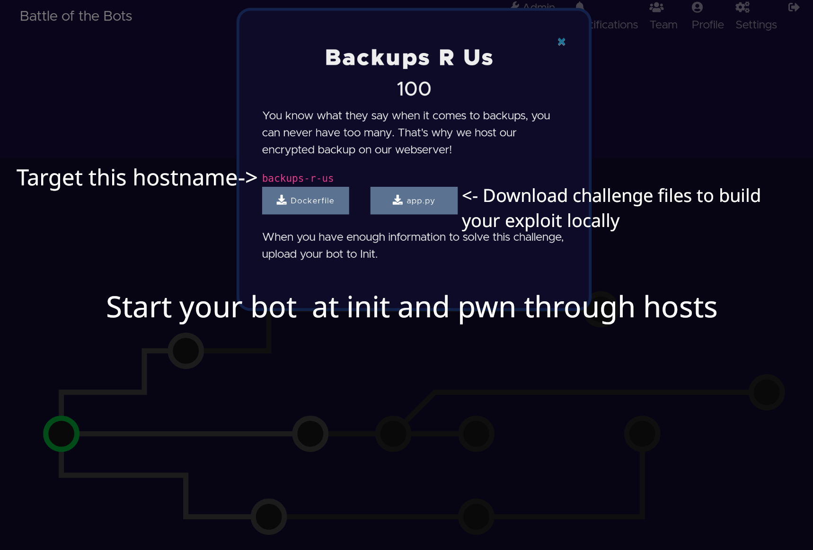
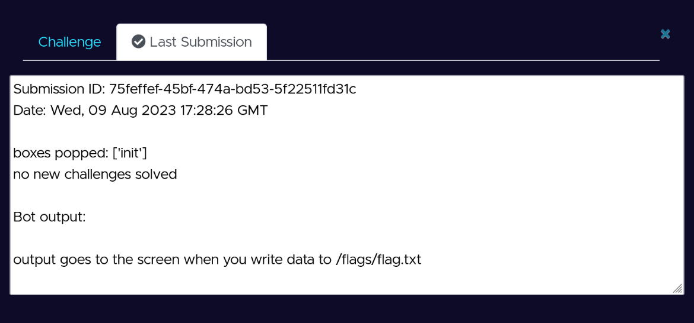

# About
The Office of the Under Secretary of Defense for Research and Engineering ([OUSD R&E](https://www.cto.mil/)) inspired by DARPA's [Cyber Grand Challenge](https://www.darpa.mil/program/cyber-grand-challenge) is kicking off a series of challenges to tackle some of the hardest shared challenges public, private and academic sectors face via  "micro-challenges".
The goals of these "micro-challenges" are to produce a community contributed set of forensic tools or unique data sets that can be transitioned back into one's day job, academic research, etc...

The next event is Battle of The Bots, and will be hosted at [DEF CON]([https://bsidescharm.org](https://defcon.org/)), August 10th through 13th, 2023.
Have a question leading up to DEF CON? Join our Discord [here](https://www.discord.gg/PJEHwFFdzk). During the event we will be using the official DEF CON discord.

# Battle of The Bots Overview
Battle of The Bots (BOTB) is a reverse engineering and capability development competition where competitors are is tasked with identifing and exploiting custom and known vulnerabilities in a variety of services. Competitors must then use the capabilities and exploits they have developed to gain access and pivot through  branching networks that comprise a "map."

### Player Versus Environment (PVE)
Starting from the initial point of compromise, competitors will discover new vulnerable services as they uncover more of each map, along with the information necessary to locally recreate the services seen in the environment so that they can develop and test their exploits.
Competitors will then take these exploits and incorporate them into a worm that can spread itself through a network, pwning new services and planting flags along the way.
When they are confident their bots can successfully pwn the services, competitors can submit their worm to an upload portal, which will drop and unleash their worm onto an offline network where it can compromise the services running in the environment.
Competitors score points as they solve new challenges and conquer each map.

## How to Play - DEF CON Edition
* Select a challenge from the map.

2. Download the associated challenge files to solve the challenge locally.
Our [base Docker image](https://github.com/battleofthebots/botb-base-image) contains numerous libraries to enable your success in this competition.

3. Identify the challenge hostname and associated port to pwn. The ports match whatever the challenge binary listens on locally.

4. Once your bot is good to go, submit it to **init** to start your chain of exploits!

*Upon access to a new service, you need to spread your bot from the previous container. An example would be compromising `WOPR` and then downloading your bot from the `init` container via a Python simple http server.*

* To get logs from the execution environment, you **must** write data  to `/flags/flag.txt`.
Any data written to `/flags/flag.txt` can be obtained post bot execution by downloading the zip file.

* Ensure that "#!/usr/bin/python3" or "#!/bin/bash" is specified at the top of your Python/Bash bots!

## Maps

### Mainframe Madness
Do you miss the good ol' days of hacking when everything was just text flying around the unencrypted web? Then Mainframe Madness is the map for you. Pwn everything from basic backdoors to telnet games to get your bot through the "mainframe".

### CVE City
Modern services with modern tech-stacks, CVE City will test your ability to write you own POCs for basic CVEs and common exploitation techniques.

### Spacepunk
Spacepunk is a small but challenging map meant to test your pwning skills. Craft exploits and shellcode on custom binaries to hack your way through time!

## Bots
Each team must build a bot to automatically exploit given services and then propagate onto the next host. The bot must be completely self-contained and work offline. The environment will include all the popular python libraries and useful command line utilities needed for the competition.

A list of what is installed can be found in the [BOTB Base Image Repo](https://github.com/battleofthebots/botb-base-image).

## New to Capability Development?
Challenges span a variety of difficulty levels providing a great experience for novices and veterans to the field. We welcome new-comers to hangout onsite and engage with challenge developers and other competitors. If you are looking for a team and recommendations, reach out in Discord!

## Battle of The Bots Schedule
In person and Discord support is guaranteed daily throughout core DEF CON competition village hours. However, the environment will be up and running 24 hours a day for the duration of the conference for participants to solve challenges and work on their bots.

- Thursday: *10AM --> *6PM (PDT)
- Friday: 10AM --> 6PM (PDT)
- Saturday: 10AM --> 6PM (PDT)
- Sunday: 10AM --> *12PM (PDT)

* time subject to change

## Competition Rules & Code of Conduct
1. No attacking of the competition infrastructure (Any system or IP not designated as a challenge).
2. Teams may be up to 6 individuals
3. Each team must have atleast one member in the official DEF CON Discord server
4. Participants must comply to the Code of Conduct available upon joining the Discord server.
5. Harassment of any kind will not be tolerated.
6. Treat others with respect and dignity.
7. Do not use offensive language or language with the intent of offending others.

# FAQ
* Q) My Python bot isn't working!
* A) Ensure that "#!/usr/bin/python3" is specified at the top of the file.

* Q) How large can teams be?
* A) Teams can be up to 6 individuals.

* Q) I have a question, where can I ask?
* A) Join our Discord [here](https://www.discord.gg/PJEHwFFdzk)

* Q) Where can I find the booth?
* A) BOTB staff will be sitting at the DEF CON competition village

* Q) I have found a bug/vulnerability/security issue!
* A) Please let our judges know as soon as possible via a DM.

* Q) I have feedback, how can I submit it?
* A) At the end of the CTF, a link to  a survey will be posted in the Discord channel.

## Previous Events
* [Ghidra Golf](https://ghidra.golf)
* Battle of the Bots - BSides Charm
